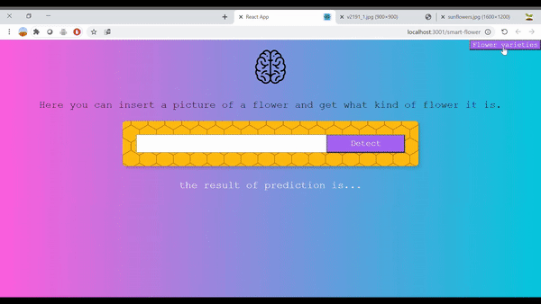

# Flowers-Recognition - Web
This is the client (front-end) side of my site, its purpose is to classify the type of flower in the image given to it as input.
For the construction of the site I used React together with CSS and HTML 
 

### You can run it locally:
1. Clone this repo
2. Run `npm install`
3. Run `npm start`

